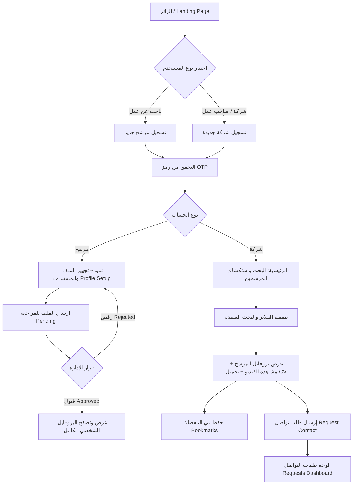

# 📋 توثيق وتدفق مشروع مـ كيميت (M-Kemet)
> **دليل شامل ومفصل لبناء وتطوير نسخة الويب (Web Application & Platform Specification)**

---

## 📌 1. نبذة عن المنصة (Executive Summary)

**مـ كيميت (M-Kemet)** هي منصة توظيف ذكية للربط بين الكفاءات والكوادر المهنية في العالم العربي (مثل مصر، دول الخليج، ودول شمال إفريقيا) وبين الشركات وأصحاب الأعمال الباحثين عن توظيف واستقدام كوادر معتمدة ومحققة.

### أطراف المنصة الرئيسية (Core Actors)
1. **الباحث عن عمل (Job Seeker / Candidate):** يقوم بإنشاء حسابه، رفع المستندات الرسمية، تصوير فيديو تعريفي احترافي مدته دقيقة، ومتابعة حالة اعتماده وطلبات التواصل الواردة من الشركات.
2. **الشركة / صاحب العمل (Employer / Company):** تقوم بالبحث والتصفية المتقدمة للمرشحين، مشاهدة الفيديوهات التعريفية، فحص السير الذاتية، حفظ المرشحين المميزين، وإرسال ومتابعة "طلبات التواصل" مع المرشحين.
3. **إدارة المنصة (Admin Panel):** مراجعة مستندات وفيديوهات المرشحين واعتمادهم أو رفضهم، ومتابعة وإدارة طلبات التواصل بين الشركات والمرشحين.

---

## 🔄 2. تدفقات العمل الرئيسية (Core User Journeys & Flows)



---

### 👤 أ. مسار الباحث عن عمل (Job Seeker Flow)

1. **التسجيل وتسجيل الدخول (Authentication):**
   - الاسم، البريد الإلكتروني، رقم الهاتف، كلمة المرور (الحد الأدنى 8 خانات)، الجنس، الدولة الحالية.
   - التحقق عبر رمز OTP يُرسل للبريد/الهاتف.
   
2. **إلزامية ملء الملف الشخصي والمستندات (Profile Setup - First Time):**
   - إذا كان الحساب جديداً ولم يملأ البيانات: يتم توجيهه **تلقائياً** إلى شاشة استكمال الملف الشخصي.
   - إذا خرج من التطبيق وعاد دون إكمال النموذج: يظل ملزماً بفتحه أولاً.
   - **البيانات والمستندات المطلوبة:**
     - الصورة الشخصية الرسمية (مع إمكانية القص والتعديل وفلترة المستندات).
     - صورة الهوية الوطنية / بطاقة الرقم القومي.
     - صورة جواز السفر (PDF أو JPG).
     - السيرة الذاتية CV (ملف PDF أو DOCX).
     - **الفيديو التعريفي (Intro Video):** مقطع فيديو مسجل مدته 1 دقيقة يشرح فيه المرشح اسمه، مهنته، خبراته، والدول المستهدفة.
     - المهنة وسنوات الخبرة، والمؤهل الدراسي، واللغات، وإمكانية السفر، والدول المرغوب السفر إليها (مثل السعودية، الإمارات، الكويت.. إلخ).

3. **حالة الطلب بعد الإرسال (Request Status Lifecycle):**
   - **قيد المراجعة (`pending`):** تظهر شاشة حالة الطلب تفيد بأنه قيد مراجعة المستندات من قِبل إدارة كيميت مع زر انتقال للرئيسية.
   - **تم الاعتماد (`active` / `approved`):** يفتح مباشرة للبروفايل الكامل، ويصبح ملف المرشح مرئياً للشركات في نتائج البحث.
   - **مرفوض (`rejected`):** عند دخول المرشح، يتم فتح نموذج التعديل مجدداً مع إظهار ملاحظات الرفض ليتمكن من تصحيح المستندات وإعادة إرسالها.

4. **طلبات التواصل الواردة للمرشح (`api/my-requests`):**
   - يرى قائمة بطلبات التواصل والاستقدام المرسلة إليه من الشركات لمتابعة عروض العمل.

---

### 🏢 ب. مسار الشركة / صاحب العمل (Company / Employer Flow)

1. **التسجيل والدخول:**
   - اسم الشركة، السجل التجاري، البريد الرسمي، الهاتف، الدولة، كلمة المرور.
   - التحقق عبر OTP.

2. **البحث المتقدم وتصفية الكوادر (Candidate Search & Filtering):**
   - شريط بحث سريع (بالاسم، المهنة، المهارة).
   - اختصارات سريعة (المهن الأكثر طلباً، الدول الأكثر استقداماً).
   - نافذة فلاتر متطورة (Modal / Drawer):
     - الدولة الحالية للمرشح.
     - الدول المستهدفة للسفر.
     - مستوى الخبرة وسنوات العمل.
     - حالة سريان جواز السفر (ساري / غير ساري).

3. **كارت المرشح (Candidate Card in Search):**
   - الصورة، الاسم، شارة التحقق (محقق ✅).
   - المهنة وسنوات الخبرة.
   - شرائح بيانات (الموقع الحالي 🇪🇬، الوجهة المطلوبة 🇸🇦، حالة جواز السفر).
   - زر حفظ المرشح (Bookmark) للرجوع إليه لاحقاً.
   - زر "عرض الملف" للانتقال للبروفايل الكامل.

4. **شاشة البروفايل الكامل للمرشح (Candidate Detail View):**
   - ملخص بيانات المرشح الكاملة.
   - **مشغل الفيديو التعريفي (1-min Pitch Video Player)**.
   - المؤهلات، اللغات، والنبذة المهنية.
   - زر تحميل السيرة الذاتية (CV Download).
   - **شريط إجراء طلب التواصل (Contact Request Bar):**
     - زر تفاعلي رئيسي: `طلب تواصل` (Request Contact).
     - عند الضغط: يتم إرسال الطلب ويتحول الزر لحالة `طلب تواصل قيد الانتظار` مع منعه من التكرار طالما الطلب معلق.
     - **قاعدة هامة:** إذا قام الأدمن بمسح/حذف الطلب أو رفضه، يعود الزر فوراً لحالته الطبيعية المفتوحة لتمكين الشركة من إرسال طلب جديد.

5. **تاب / صفحة طلبات التواصل (`RequestsTab` - `api/my-requests`):**
   - صفحة مخصصة للشركة لمتابعة جميع طلبات التواصل التي أرسلتها.
   - **تصميم الكارت البسيط والمحدد (Simple Request Card):**
     - **كود الطلب المرجعي (`code`):** مثل `#15` أو `Mkemet-ppv0o7`.
     - **شارة الحالة (`status_label`):** مثل "طلب تواصل قيد الانتظار" (كهرماني) أو "مقبول" (أخضر) أو "مرفوض" (أحمر).
     - **اسم المرشح (`name`):** بخط عريض وواضح.
     - **المهنة / التخصص (`profession`).**
     - **تاريخ ووقت الإرسال (`request_date`).**
     - *(ملاحظة معتمدة: لا يحتوي هذا الكارت على زر بوكمارك أو تفاصيل إضافية غير موجودة في الـ Payload).*

6. **المرشحين المحفوظين (Saved Candidates / Bookmarks):**
   - صفحة مستقلة تعرض المرشحين الذين قامت الشركة بحفظهم للرجوع إليهم بسهولة مع إمكانية إزالة الحفظ.

---

## 🌐 3. متطلبات واجهة موقع الويب (Web UI/UX Specification)

عند بناء الموقع (React / Next.js / Vue / Angular)، يُوصى بالهيكلية التالية:

### 1. الرأس وشريط التنقل العلوي (Global Header & Navbar)
- **شعار المنصة (M-Kemet Logo)**.
- قائمة التنقل: الرئيسية، البحث عن كفاءات، عن كيميت، تواصل معنا.
- زر تبديل اللغة (العربية RTL كافتراضي / English LTR).
- **منطقة الحساب (User Account Menu):**
  - للشركة: طلبات التواصل، المرشحين المحفوظين، ملف المنشأة، تسجيل الخروج.
  - للمرشح: ملفي الشخصي، مستنداتي، طلبات التواصل الواردة، تسجيل الخروج.

### 2. الصفحات الرئيسية لنسخة الويب (Web Pages Breakdown)

| الصفحة في الويب | المسار (Route) | الوظيفة والمحتوى |
| :--- | :--- | :--- |
| **الصفحة الرئيسية (Landing Page)** | `/` | واجهة تسويقية، إحصائيات، أبرز المهن والكوادر، آراء العملاء، دعوة للتسجيل (CTA). |
| **تسجيل الدخول / الحسابات** | `/login`, `/register` | بوابات مخصصة لاختيار نوع الحساب (شركة أو باحث عن عمل). |
| **التحقق من OTP** | `/verify-otp` | إدخال الكود المكون من 4 أو 6 أرقام مع عداد لإعادة الإرسال. |
| **استكمال ملف المرشح** | `/candidate/setup` | Wizard متعدد الخطوات أو صفحة مقسمة لرفع المستندات، تسجيل الفيديو، والبيانات المهنية. |
| **حالة اعتماد الملف** | `/candidate/status` | شاشة توضح حالة مراجعة الإدارة (Pending / Approved / Rejected). |
| **بروفايل المرشح (العام)** | `/candidates/:id` | البروفايل الذي تراه الشركات؛ يحتوي مشغل الفيديو، البيانات، وزر طلب التواصل. |
| **محرك بحث المرشحين** | `/candidates` | شبكة كروت (Grid) مع شريط تصفية جانبي (Sidebar Filters) وفرز ذكي. |
| **لوحة طلبات التواصل للشركة** | `/company/requests` | قائمة بكروت الطلبات البسيطة (`code`, `name`, `profession`, `status_label`, `date`). |
| **المرشحين المحفوظين للشركة** | `/company/bookmarks` | قائمة بالكوادر المحفوظة مع إمكانية الوصول المباشر لملفاتهم. |
| **إعدادات الحساب** | `/settings` | تعديل البيانات، إدارة الإشعارات، تغيير كلمة المرور، وحذف الحساب. |

---

## 🔌 4. قائمة واجهات الـ Backend البرمجية (API Reference)

### أ. التوثيق والمستخدمين (Authentication & Profile)
| Endpoint | Method | الوصف |
| :--- | :--- | :--- |
| `/api/register/candidate` | `POST` | تسجيل باحث عن عمل جديد |
| `/api/register/company` | `POST` | تسجيل شركة جديدة |
| `/api/verify-otp` | `POST` | التحقق من كود الـ OTP |
| `/api/resend-otp` | `POST` | إعادة إرسال كود الـ OTP |
| `/api/login` | `POST` | تسجيل الدخول (يرجع Bearer Token ونوع المستخدم) |
| `/api/profile` | `GET` | الحصول على بيانات الحساب الحالي المسجل |
| `/api/forgot-password` | `POST` | طلب استعادة كلمة المرور |
| `/api/verify-reset-otp` | `POST` | التحقق من كود الاستعادة |
| `/api/reset-password` | `POST` | تعيين كلمة المرور الجديدة |
| `/api/logout` | `POST` | تسجيل الخروج |
| `/api/delete-account` | `POST` | حذف الحساب نهائياً |

### ب. القوائم العامة والفلاتر (Lookups)
| Endpoint | Method | الوصف |
| :--- | :--- | :--- |
| `/api/countries` | `GET` | قائمة الدول وعملاتها وأعلامها |
| `/api/countries/top-6` | `GET` | أكثر 6 دول طلباً للاستقدام والسفر |
| `/api/professions` | `GET` | قائمة كافة التخصصات والمهن |
| `/api/professions/popular`| `GET` | المهن الأكثر طلباً وشعبية |
| `/api/experience-levels` | `GET` | مستويات الخبرة (مبتدئ، متوسط، خبير..) |
| `/api/qualifications` | `GET` | المؤهلات الدراسية |
| `/api/genders` | `GET` | خيارات الجنس (ذكر / أنثى) |

### ج. خاصة بالباحث عن عمل (Candidate Services)
| Endpoint | Method | الوصف |
| :--- | :--- | :--- |
| `/api/candidate/my-document` | `GET` | جلب مستندات وملف المرشح وحالة المراجعة |
| `/api/candidate/update-document`| `PUT` | تحديث البيانات المهنية والشخصية |
| `/api/candidate/documents` | `POST` | رفع مستند (صورة شخصية، بطاقة هوية، جواز سفر، سيرة ذاتية) Multipart |
| `/api/candidate/video` | `POST` | رفع الفيديو التعريفي (1 دقيقة) Multipart مع `duration_seconds` |
| `/api/candidate/documents/{id}/file`| `GET` | استعراض أو تنزيل ملف المستند |

### د. خاصة بالشركة والبحث (Company & Recruitment Services)
| Endpoint | Method | الوصف |
| :--- | :--- | :--- |
| `/api/job-seekers` | `GET` | جلب قائمة المرشحين المعتمدين مع إمكانية البحث النصي |
| `/api/job-seekers/search` | `GET` | البحث المخصص |
| `/api/job-seekers/filter` | `GET` | تصفية المرشحين حسب الفلاتر المحددة |
| `/api/job-seekers/{id}` | `GET` | جلب الملف الكامل للمرشح (يشمل الفيديو والسيرة ورابط التواصل) |
| `/api/job-seekers/{id}/contact-request` | `POST` | إرسال طلب تواصل للمرشح المحدد |
| `/api/my-requests` | `GET` | جلب قائمة طلبات التواصل المرسلة من الشركة |
| `/api/bookmarks` | `GET` | جلب قائمة المرشحين المحفوظين في المفضلة |
| `/api/job-seekers/{id}/bookmark` | `POST` | إضافة / إزالة المرشح من المفضلة (Toggle) |

---

## 📦 5. نماذج البيانات الفعلية (Sample JSON Payloads)

### نموذج استجابة قائمة طلبات التواصل (`GET /api/my-requests`):
```json
{
    "status": true,
    "message": "Operation completed successfully",
    "data": [
        {
            "id": 15,
            "code": "Mkemet-ppv0o7",
            "name": "نهى عصام العبد الله",
            "profession": "Digital Marketing Specialist",
            "request_date": "2026-09-13 12:41:08",
            "created_at": "2026-09-13T12:41:08+00:00",
            "status": "pending",
            "status_label": "طلب تواصل قيد الانتظار"
        }
    ],
    "pagination": {
        "current_page": 1,
        "per_page": 10,
        "total": 1,
        "last_page": 1
    }
}
```

### نموذج استجابة تفاصيل المرشح (`GET /api/job-seekers/{id}`):
```json
{
    "status": true,
    "message": "Candidate details retrieved successfully",
    "data": {
        "id": 126,
        "name": "منة الله حسام",
        "profession_title": "Civil Engineer",
        "profession_with_experience": "Civil Engineer | 2 سنوات",
        "experience_years": 2,
        "profile_photo": "https://m-kemet.aqarmousa.com/storage/documents/personal_photos/candidate_47.jpg",
        "is_verified": true,
        "verification_badge": "محقق",
        "is_contact_requested": false,
        "contact_request_status": "",
        "current_country": {
            "name": "Egypt",
            "flag": "🇪🇬"
        },
        "target_countries": [
            { "name": "Saudi Arabia", "flag": "🇸🇦" }
        ],
        "passport_status": {
            "has_passport": true,
            "is_approved": false,
            "status_label": "قيد المراجعة"
        },
        "video": {
            "video_url": "https://m-kemet.aqarmousa.com/storage/videos/candidate_126.mp4",
            "thumbnail_url": "https://m-kemet.aqarmousa.com/storage/videos/thumbnails/126.jpg"
        },
        "cvUrl": "https://m-kemet.aqarmousa.com/storage/cv/candidate_126.pdf"
    }
}
```

---

## 🎨 6. نظام التصميم والألوان (Design System & Theme Tokens)

لضمان تطابق هوية موقع الويب مع التطبيق:

| العنصر | القيمة اللونية (Hex) | الاستخدام |
| :--- | :--- | :--- |
| **Dark Navy (الرئيسي)** | `#0B192C` أو `#0A192F` | الأزرار الرئيسية، العناوين البارزة، عناصر التنقل النشطة |
| **Steel Blue (الثانوي)** | `#1E3E62` | المسميات المهنية، العناوين الفرعية، الأيقونات الثانوية |
| **Sky Blue / Accent** | `#4682B4` / `#38BDF8` | الروابط، الحدود النشطة، المؤشرات |
| **Page Background** | `#F8FAFC` أو `#F1F5F9` | خلفية الموقع العامة والبطاقات الهادئة |
| **Card Background** | `#FFFFFF` | خلفية كروت المرشحين ونماذج الإدخال |
| **Border Grey** | `#E2E8F0` | الحدود والفواصل بين العناصر |
| **Warning Amber (Pending)**| `#F59E0B` (خلفية: `#FFFBEB`)| شارات الانتظار وقيد المراجعة |
| **Success Green (Approved)**| `#10B981` (خلفية: `#ECFDF5`)| شارات التوثيق والقبول واعتماد الطلب |
| **Error Red (Rejected)** | `#EF4444` (خلفية: `#FEF2F2`)| شارات الرفض والتنبيهات وحذف الحساب |

### التوجيه والخطوط (Typography & Direction):
- **الاتجاه الأساسي:** اليمين لليسار (RTL) للغة العربية مع دعم كامل للـ LTR باللغة الإنجليزية.
- **الخط المعتمد الموصى به للويب:** `Cairo` أو `Alexandria` أو `IBM Plex Sans Arabic` من Google Fonts لضمان القراءة المريحة والمظهر العصري الفاخر.

---

## 💡 7. قواعد عمل وتفاصيل هامة للمطورين (Important Business Rules)

1. **التعامل مع زر "طلب تواصل":**
   - عندما ترسل الشركة طلباً، يتحول الزر إلى حالة غير قابلة للضغط (`disabled`) بنص "طلب تواصل قيد الانتظار".
   - **إذا قام الأدمن بحذف الطلب من لوحة التحكم:** يعود الزر تلقائياً لحالته الأصلية المفعلة عند فتح الملف الشخصي للمرشح لتمكين الشركة من إرسال طلب تواصل جديد فوراً.
2. **شروط الفيديو التعريفي للمرشح:**
   - مدة الفيديو 60 ثانية (1 دقيقة كحد أقصى).
   - حجم الملف لا يتجاوز 50 ميجابايت بصيغة MP4/WebM.
3. **التحقق من كلمات المرور:**
   - الشرط المعتمد لكلمة المرور هو: **ألا يقل الطول عن 8 خانات فقط**.
4. **تزامن الكاش مع السيرفر:**
   - السيرفر هو المصدر النهائي للحقيقة (Single Source of Truth)؛ أي تحديث في حالة المرشح أو الطلبات على السيرفر ينعكس فوراً على واجهة المستخدم.

---

> تم إعداد هذا الملف ليكون مرجعاً تقنياً وتصميمياً كاملاً ومباشراً لفريق عمل موقع الويب لضمان تطابق الأداء والوظائف وهوية المنصة بنسبة 100%.
